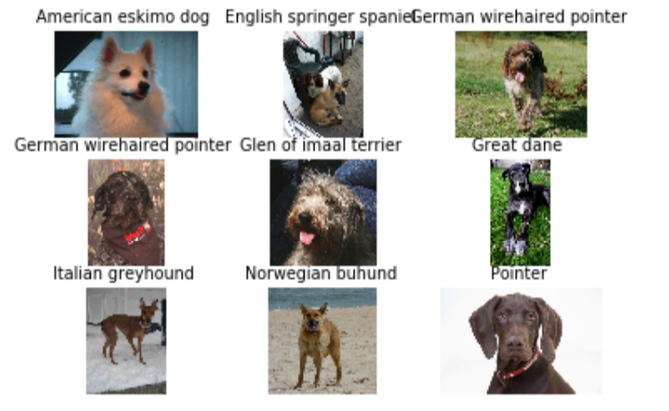

# Machine Learning Engineer Nanodegree

### Name: Ahmed Monjurul Hasan
### Date: Mar 11, 2020

<a id='index'></a>
## Table of Contents
- [Project Overview](#overview)
- [Problem Statement](#statement)
- [Metrics](#metrics)
- [Data Exploration and Visualization](#explore)
- [Algorithm and Techniques](#algo)
- [Benchmark](#bench)
- [Data Preprocessing](#preprocess)
- [Implementation](#implement)
  - [Step 1](#step1): Detect Humans
  - [Step 2](#step2): Detect Dogs
  - [Step 3](#step3): Create a CNN to Classify Dog Breeds (from Scratch)
  - [Step 4](#step4): Use a CNN to Classify Dog Breeds (using Transfer Learning)
  - [Step 5](#step5): Create a CNN to Classify Dog Breeds (using Transfer Learning)
  - [Step 6](#step6): Write your Algorithm
- [Refinement](#refine)
- [Model Evaluation and Validation](#eval)
- [Justification](#just)
- [Reflection](#reflection)
- [Improvement](#improvement)
- [Flask Web App](#flask)
  	- [Dog detection and Breed Prediction](#dog)
  	- [Human or Unknown Detection](#human)
  	- [Top5 Prediction](#top5)
- [Web App Usage Instructions](#run)
   	- [Running in localhost](#local)
  	- [ngrok Deployment](#ngrok)

- [Software Requirements](#sw)
- [Files](#files)
- [Credits and Acknowledgements](#credits)


<a id='overview'></a>
### Project Overview
 | 
<p> There are thousands of different dog breeds in the world. Some of these dog breeds are too close to differentiate from their images. For example, the above two dogs seem to belong to the same breed. But, the left one is Norfolk Terrier, and the right one Norwich Terrier.  With the advancement of technology, computers are getting enough intelligent to distigush different classes of objects from their images. Since 2010, the ImageNet project runs an annual software contest, the ImageNet Large Scale Visual Recognition Challenge (ILSVRC), where software programs compete to correctly classify and detect objects and scenes useing one thousand non-overlapping classes [1]. In this capstone project, I want to leverage the state of art of image classification model on Imagenet to teach computer to predict 133 dog's breed from an image using deep learning algorithms.

[Back to Table of Content](#index)

<a id='statement'></a>
### Problem Statement
<p> I want to go above and beyond the dog's breed classification problem by tackling two minor but interesting problems as well such as human face detection and dog detection using computer vision and machine learning techniques. Using these three solutions, I would like to build an application that could be used as part of a mobile or web app. This application  will accept any user-supplied image as input. If a dog is detected in the image, it will provide an estimate of the dog's breed. If a human is detected, it will provide an estimate of the dog breed that is most resembling. If it detects neither a dog nor a human, it will give an appropriate error message.

<hr/> 

[Back to Table of Content](#index)

<a id='metircs'></a>
## Metrics
Since we are dealing with a multi-classification problem here and the data is slightly imbalanced, I used accuracy evaluation metric and negative log-likelihood loss function. The main objective in a learning model is to reduce (minimize) the loss function's value with respect to the model's parameters by changing the weight vector values through different optimization methods, such as backpropagation in neural networks.

Loss value implies how well or poorly a certain model behaves after each iteration of optimization. Ideally, one would expect the reduction of loss after each, or several, iteration(s).

The accuracy of a model is usually determined after the model parameters are learned and fixed and no learning is taking place. Then the test samples are fed to the model and the number of mistakes (zero-one loss) the model makes are recorded, after comparison to the true targets. Then the percentage of misclassification is calculated.

For example, if the number of test samples is 1000 and model classifies 950 of those correctly, then the model's accuracy is 95.0%. [Ref](https://stackoverflow.com/questions/34518656/how-to-interpret-loss-and-accuracy-for-a-machine-learning-model)

Also, we have employed 3 types of error metrics namely top-1, top-3 and top-5 error. In the case of top-1 error, we check if the top class (the one having the highest probability) is not the same as the target label.

In the case of top-3 errore, we check if the target label is not one of our top 3 predictions (the 3 ones with the highest probabilities)

In the case of top-5 error, we check if the target label is not one of our top 5 predictions (the 5 ones with the highest probabilities). 
<br/> 

<hr/> 

[Back to Table of Content](#index)

<a id='explore'></a>
## Data Exploration and Visualization
<p> The dog dataset has 6680 images for training, 835 images for validation and 836 images for testing of 133 breeds. All these images have RGB channels and different sizes. So, they need to normalized and resiaed before using in the deep learning model.
From the train, test and valid dataset of dog images, we get the following distribution and statistics from ```dog_app2.ipynb```:


<hr/> 

[Back to Table of Content](#index)

<a id='algo'></a>
### Algorithm and Techniques
<p> The solution of the project is divided into following steps:
In the first step, I'll use OpenCV's implementation of Haar feature-based cascade classifiers to detect human faces in images. In the seond step, I'll use a pre-trained VGG16 model to detect dogs in images. In the third step, I'll create a CNN that classifies dog breeds. I'll create my CNN from scratch to attain a test accuracy of at least 1%. In the fourth step, I'll use the pre-trained VGG-16 model as a fixed feature extractor, where the last convolutional output of VGG-16 is fed as input to my model. In Step 5, I'll use transfer learning to create a CNN using VGG-19 bottleneck features. In the last step, I'll write an algorithm that accepts a file path to an image and first determines whether the image contains a human, dog, or neither. Then, if a dog is detected in the image, return the predicted breed. If a human is detected in the image, return the resembling dog breed. Otherwise, it provides output that indicates an error.

<hr/> 

[Back to Table of Content](#index)

<a id='algo'></a>
### Benchmark Model
<p> Our model will be compared with different benchmark models in a 
kaggle competition(https://www.kaggle.com/c/dog-breed-identification/discussion)

<a id='preprocess'></a>
## Data Preprocessing
Each image in the train, valid and text dataset goes thorugh a number of preprocessing steps:

1. Train and Valid Dataset images goes through a series of transforms.RandomRotation(10), transforms.Resize(256), transforms.CenterCrop(224),transforms.RandomHorizontalFlip()
1. Test Dataset images goes through a series of transforms.Resize(256) and transforms.CenterCrop(224) 
1. Normalize: Each image is normalized by mean=[0.485, 0.456, 0.406] and std=[0.229, 0.224, 0.225]

<hr/> 

[Back to Table of Content](#index)


<a id='implement'></a>
## Implementation
The implementation of the project is divided into following steps:

<a id='step1'></a>
### Step 1: Detect Humans

We use OpenCV's implementation of Haar feature-based cascade classifiers to detect human faces in images. OpenCV provides many pre-trained face detectors, stored as XML files on github. We have downloaded one of these detectors and stored it in the haarcascades directory.<br/>
Before using any of the face detectors, it is standard procedure to convert the images to grayscale. The detectMultiScale function executes the classifier stored in face_cascade and takes the grayscale image as a parameter. 

<hr/> 

[Back to Table of Content](#index)

<a id='step2'></a>
### Step 2: Detect Dogs
We use a pre-trained VGG16 model to detect dogs in images. Our first line of code downloads the ResNet-50 model, along with weights that have been trained on ImageNet, a very large, very popular dataset used for image classification and other vision tasks. ImageNet contains over 10 million URLs, each linking to an image containing an object from one of 1000 categories. Given an image, this pre-trained VGG16 model returns a prediction (derived from the available categories in ImageNet) for the object that is contained in the image.<br/>
While looking at the [dictionary](https://gist.github.com/yrevar/942d3a0ac09ec9e5eb3a), you will notice that the categories corresponding to dogs appear in an uninterrupted sequence and correspond to dictionary keys 151-268, inclusive, to include all categories from `'Chihuahua'` to `'Mexican hairless'`.  Thus, in order to check to see if an image is predicted to contain a dog by the pre-trained VGG16 model, we need only check if the `ResNet50_predict_labels` function above returns a value between 151 and 268 (inclusive).

[Back to Table of Content](#index)

<a id='step3'></a>
### Step 3: Create a CNN to Classify Dog Breeds (from Scratch)
Now that we have functions for detecting humans and dogs in images, we need a way to predict breed from images. In this step, we create a CNN that classifies dog breeds. We create our CNN from scratch to attain a test accuracy of at least 1%.

[Back to Table of Content](#index)

<a id='step4'></a>
### Step 4: Use a CNN to Classify Dog Breeds (using Transfer Learning)
To reduce training time without sacrifysing accuracy, we have used the pre-trained VGG-16 model as a fixed feature extractor, where the last convolutional output of VGG-16 is fed as input to our model. We only add a global average pooling layer and a fully connected layer, where the latter contains one node for each dog category and is equipped with a softmax.

[Back to Table of Content](#index)

<a id='step5'></a>
### Step 5: Create a CNN to Classify Dog Breeds (using a different Transfer Learning)- Refinement
In Step 5, we used transfer learning to create a CNN using VGG-19 bottleneck features. In this section, we used the bottleneck features from a different pre-trained model such as VGG19. 

[Back to Table of Content](#index)


<a id='step6'></a>
### Step 6: Write your Algorithm
In this step, we write an algorithm that accepts a file path to an image and first determines whether the image contains a human, dog, or neither. Then,
* if a dog is detected in the image, return the predicted breed.
* if a human is detected in the image, return the resembling dog breed.
* if neither is detected in the image, provide output that indicates an error.

[Back to Table of Content](#index)

<hr/> 

[Back to Table of Content](#index)


<a id='refine'></a>
## Refinement
In our first design, we have used transfer learning to create a CNN using VGG-16 bottleneck features. As a refinement, in our second model we have used transfer learning to create a CNN using VGG-19 bottleneck features. Second model gives slightly better results with better performance metrics. Please refer to the [next section](#eval) for a detailed comparison. Here are some missclassified images (top-5 error images) from the first model prediction:


Here are some missclassified images (top-5 error images) from the second model prediction:


From these two figures, we can see that out of these 9 images, 5 images were misclassified by both models. But each model made some unique mistakes as well from the other model.

<br/>
<hr/> 

[Back to Table of Content](#index)


[1] Olga Russakovsky*, Jia Deng*, Hao Su, Jonathan Krause, Sanjeev Satheesh, Sean Ma, Zhiheng Huang, Andrej Karpathy, Aditya Khosla, Michael Bernstein, Alexander C. Berg and Li Fei-Fei. (* = equal contribution) ImageNet Large Scale Visual Recognition Challenge. IJCV, 2015.
